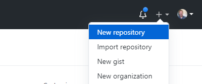
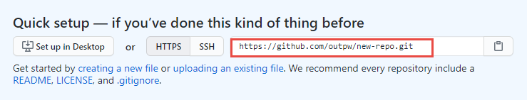

# So you want to get fancy?  
I get it!

## Recommended Workflow:

**First, install Ruby and Jeckyll.**    

- See these great instructions for [Mac](https://programminghistorian.org/en/lessons/building-static-sites-with-jekyll-github-pages#on-a-mac-){:target="_blank"} and [Windows](https://programminghistorian.org/en/lessons/building-static-sites-with-jekyll-github-pages#on-windows-){:target="_blank"}.

- Also recommended: [Bundler](https://bundler.io/){:target="_blank"}. If you've installed Ruby and Jekyll following the instructions linked above, you should be able to install bundler with the following command:  
```
gem install jekyll bundler
```

- You'll also want a good text editor...  


- **Now**, find a theme you like, go to it's GitHub repository then...  


Step 1
{: .label .label-step}
Clone the repo down to your local machine. From  your terminal:
```
git clone https://github.com/pages-themes/hacker.git
```  


Step 2
{: .label .label-step}
Since you've installed Ruby, Jekyll, and Bundler, you can spin up your site locally with the following command:  
```
bundle exec jekyll serve
```  

Now you're serving your site on your own computer! My default server address is `http://127.0.0.1:4000`, but check your prompt and it should tell you. Just open up your browser and go to that address.  

Step 3
{: .label .label-step}
Now do whatever you want!

- Rather than the simple site we used in the hands-on example, this site has everything, including all of the styling.  
- The styling is found in the `_sass` and `assests/css` folder.
- But note that this is not your standard CSS style sheet, most of the styling is managed by [SASS](https://sass-lang.com/){:target='_blank'}.
- Open it up in your favorite text editor and don't forget to **Have Fun!**  


## Publish your site!
Once you've finished going to town on your snappy website (and added and committed the changes to your repo), you can put it in a remote repository on GitHub.

Step 1
{: .label .label-step}
Create a new remote repository on GitHub  
  

Step 2
{: .label .label-step}
Copy the url of your new remote repository  


Step 3
{: .label .label-step}
In your terminal, navigate to the folder containing your site directory/repo. Reset the remote origin to your newly created GitHub repository:
```
git remote set-url origin https://github.com/your-user-name/your-repo.git
```  

Step 4
{: .label .label-step}
Now push your changes up to the remote repository:  
```
git push origin main   
```
*might also be `master` instead of `main`  

Step 5
{: .label .label-step}
Publish your site in the repository settings as shown in [previous exercise](../GH_Pages_Materials/GH-Pages-Hands-On).
