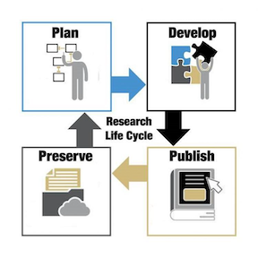
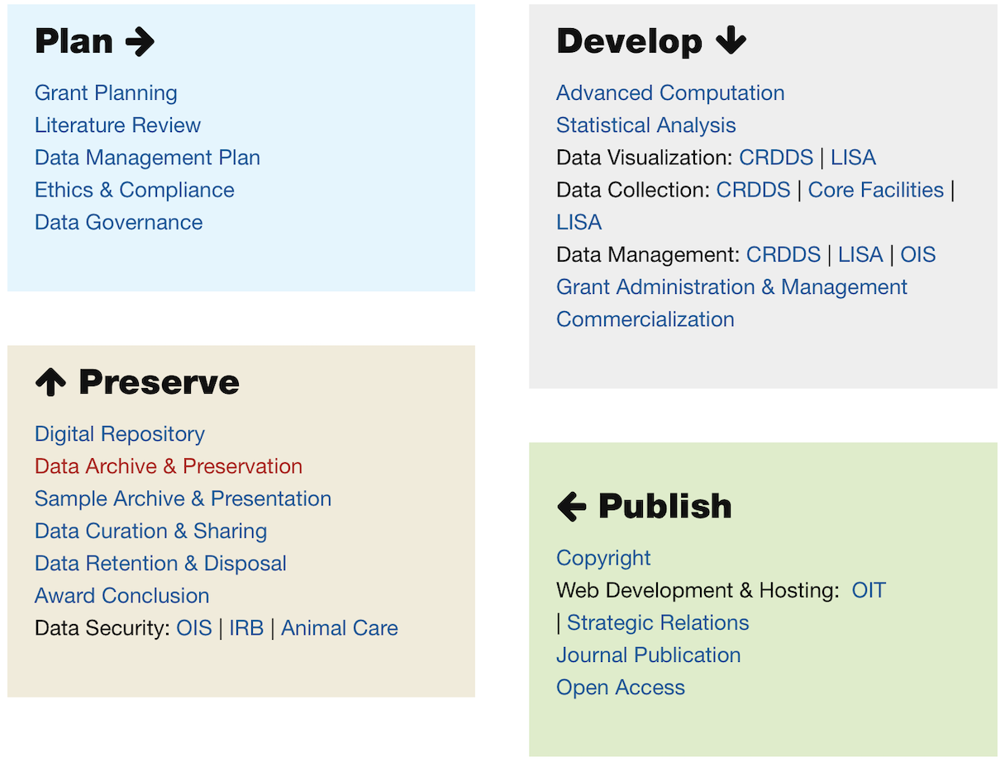

# Research Data Bootcamp Overview

Welcome to the Research Data Bootcamp for incoming CU Boulder graduate students. The Bootcamp is sponsored and organized by the Center for Research Data and Digital Scholarship (CRDDS), which is a collaboration between CU Boulder University Libraries, and Research Computing. You can view the CRDDS website [here](https://www.colorado.edu/crdds/).

As incoming graduate students, it is likely that you will work with research data at some point during the course of your respective programs. The goal of this Bootcamp is to provide you with an overview of some of the skills, strategies, and best practices that will help you to get started in pursuing this kind of work. The Bootcamp does not presuppose any prior experience in working with research data, and all of the sessions are introductory in nature. Our purpose is not to help you master any given topic, but to provide a useful and productive starting point for further exploration and learning. As you explore further after the Bootcamp and into the semester, we hope you'll make use of CRDDS's many resources, such as opportunities for individual consultations and workshops (many of which will cover the material introduced here in greater depth). More information about these opportunities is provided on the CRDDS website. For related offerings, please also see the [website](https://www.colorado.edu/lab/lisa/) of our collaborators at the Laboratory for Interdisciplinary Statistical Analysis (LISA).

In thinking about the various skills and tasks that are relevant to projects that involve research data, librarians and data professionals often think in terms of a heuristic called the research data lifecycle:

The lifecycle model specifies, in broad terms, the distinct yet interconnected stages of a data-intensive research project; each stage involves a variety of more specific tasks and competencies, as represented in the following [graphic](https://www.colorado.edu/crdds/what-we-do/research-lifecycle) from the CRDDS website:

By attending the Bootcamp, our hope is that you will be empowered to navigate the research data lifecycle with respect to your own work, in a deliberate and intentional way.

The different sessions of the Bootcamp address themselves to various stages of this research data lifecycle (italicized words correspond to the stage(s) of the research data lifecycle that the session will emphasize).

* The first session, on **GitHub and GitHub Pages**, taught by CU Boulder Libraries' Map and Earth Sciences Librarian Phil White, will explore how you can use GitHub and GitHub pages as platforms to collaborate with others, and to share and disseminate your work (*Publish; Preserve*)
* Our second session, on *Containerization with Docker*, taught by High Performance Computing Specialist Daniel Trahan, will discuss containerization as a strategy for ensuring the reproducibility of your analysis (*Develop; Preserve*)
* Our third session, on **Finding and Evaluating Data**, taught by CRDDS data librarians Jordan Wrigley and Adi Ranganath, will present strategies for finding and evaluating data sources specific to your research needs (*Plan*)
* Our fourth session, on **Data Analysis in R**, taught by Penn St. Lecturer and recent CU Boulder PhD alum Jacob Holster, will teach you how to get started using R and R Studio as a data analysis and visualization platform (*Develop*)
* Our fifth session, on **Data Publishing and CU Scholar**, taught by CRDDS Scholarly Communication Librarian Melissa Cantrell and Director of Data and Scholarly Communication Services Andrew Johnson, will discuss best practices for data management and data archiving (*Plan; Publish; Preserve*)
* Our sixth session, on **Data Ethics and the Social Context of Data**, taught by Digital Scholarship Librarian Nickoal Eichmann-Kalwara, examines the social embeddedness of data (and the implications of this embeddedness for applied researchers) through a case study of the United States census (*Plan; Develop; Publish; Preserve*)
* Our seventh session, on **Data Analysis in Python**, taught by CRDDS Visualization Specialist Tim Dunn, will teach you how to get started using Python and Jupyter Notebooks as a data analysis and visualization platform (*Develop*).

We will conclude the Bootcamp by discussing how you can continue your learning about the various topics introduced at the Bootcamp by participating in CRDDS programs and activities during the fall semester and beyond. We will also discuss the details of the Bootcamp microcredential, which you can earn by completing a small project that demonstrates your familiarity with the topics presented at the Bootcamp.
